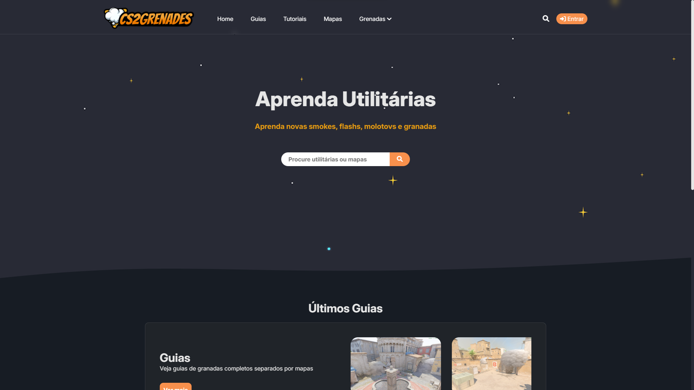
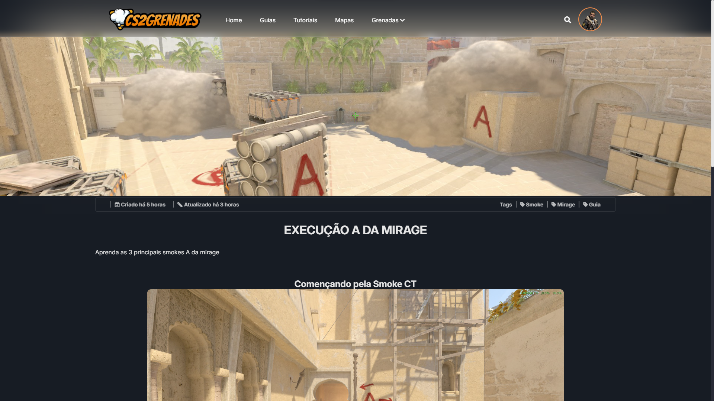
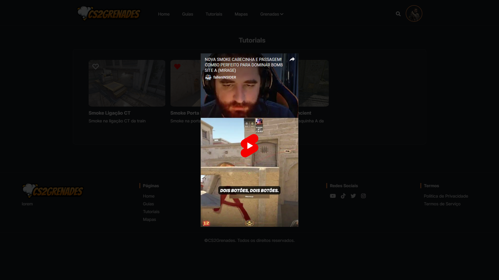
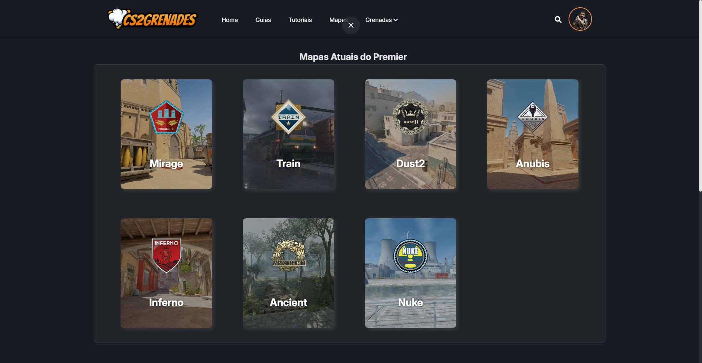
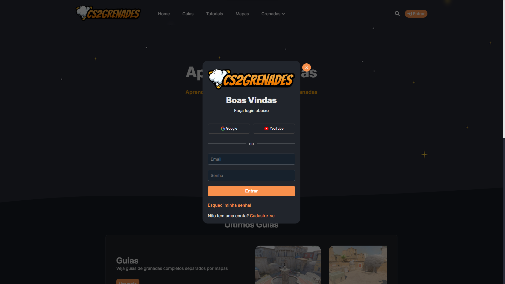
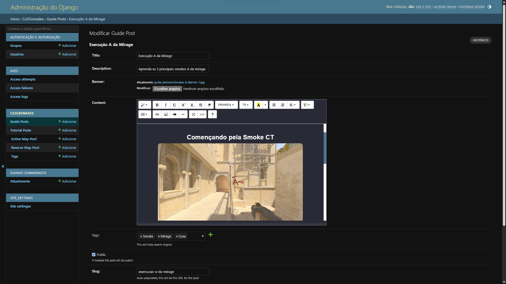

# CS2Grenades

**CS2Grenades** é um site desenvolvido para compartilhar granadas no Counter-Strike 2. Esta é a **Versão 1** do projeto, com funcionalidades básicas implementadas.

---

## 🚀 Funcionalidades

A versão inicial do **CS2Grenades** inclui as seguintes funcionalidades:

- **Página Inicial (Home)**: Apresentação do site e navegação básica. O usuário pode utilizar a busca ou navegar pelo menu.
  
- **Página de Guias**: Exibidos em cards com um título e uma descrição. Guias são posts completos que podem conter vídeos, imagens e parágrafos, com o objetivo de ensinar mais de uma granada por vez.
  
- **Página de Tutoriais**: Ao contrário dos guias, os tutoriais têm o objetivo de ensinar apenas uma ou duas granadas por vez, com vídeos rápidos. O usuário clica no post na aba de tutoriais e abre um modal com o vídeo referente ao post, que também é exibido em formato de card.
  
- **Página de Mapas**: Nessa página, o usuário pode visualizar os posts por mapas. Acima, estão os mapas atuais disponíveis no Premier e, abaixo, os mapas reservas.
  
- **Sistema de Cadastro e Login**: Usuários podem se cadastrar e logar para salvar seus guias e tutoriais favoritos. Após o login, a aba de perfil aparece no lugar do botão **Entrar**, permitindo que o usuário altere sua imagem de perfil e seus dados.
  
- **Página de Favoritos**: Exibe todos os posts favoritados pelo usuário.
  
- **Página de Administradores**: Administradores podem controlar os posts – criando, editando e excluindo –, além de gerenciar as tags e os mapas do pool ativo e reserva do jogo. Também é possível editar as configurações do site, como alterar o logo, nome, descrição, favicon e URLs para as mídias sociais disponíveis no rodapé, entre outras funções.
  

---

## 🛠️ Tecnologias Utilizadas

Este projeto foi desenvolvido utilizando as seguintes tecnologias:

- **[Django 5.1.5](https://www.djangoproject.com/)** - Framework web para Python, utilizado como base para o desenvolvimento do site.
- **[asgiref 3.8.1](https://asgiref.readthedocs.io/)** - Suporte para operações assíncronas, incluindo WebSockets e outros protocolos.
- **[django-axes 7.0.2](https://django-axes.readthedocs.io/)** - Proteção contra ataques de força bruta nos formulários de login.
- **[django-cleanup 9.0.0](https://django-cleanup.readthedocs.io/)** - Remove arquivos de mídia não utilizados no Django.
- **[django-haystack 3.3.0](https://django-haystack.readthedocs.io/)** - Framework para integração com motores de busca no Django.
- **[django-summernote 0.8.20.0](https://github.com/summernote/django-summernote)** - Integração do Summernote (editor WYSIWYG) com Django.
- **[packaging 24.2](https://pypi.org/project/packaging/)** - Ferramenta para manipulação de pacotes Python.
- **[Pillow 11.1.0](https://pillow.readthedocs.io/)** - Biblioteca para manipulação de imagens, incluindo upload, redimensionamento e tratamento de imagens.
- **[sqlparse 0.5.3](https://buildmedia.readthedocs.org/media/pdf/sqlparse/latest/sqlparse.pdf)** - Analisador e formatador de SQL.
- **[tzdata 2025.1](https://pypi.org/project/tzdata/)** - Informações de fusos horários.
- **[webencodings 0.5.1](https://pypi.org/project/webencodings/)** - Codificação de caracteres para compatibilidade com diferentes plataformas.
- **[Whoosh 2.7.4](https://whoosh.readthedocs.io/)** - Biblioteca de busca para Python, usada com o Django Haystack.

---

## 💻 Como Rodar o Projeto

### 1. Clonando o Repositório

Clone o repositório para sua máquina local:

```
git clone https://github.com/usuario/NomeDoRepositorio.git
```

### 2. Instalando Dependências

Entre no diretório do projeto e instale as dependências:

```
cd NomeDoRepositorio
pip install -r requirements.txt
```

### 3. Realizando as Migrações

No diretório do projeto, faça as migrações para configurar o banco de dados:

```
python manage.py makemigrations
python manage.py migrate
```

### 4. Criando um Superusuário

Crie um superusuário para acessar o painel de administração do Django:

```
python manage.py createsuperuser
```

Preencha as informações solicitadas (nome de usuário, email, senha). Após criar o superusuário, você poderá acessar o painel admin.

### 5. Rodando o Servidor

Execute o servidor local do Django:

```
python manage.py runserver
```

O site estará disponível em geralmente em [http://127.0.0.1:8000/](http://127.0.0.1:8000/). 

Acesse [http://127.0.0.1:8000/admin](http://127.0.0.1:8000/admin) e faça login com o superusuário criado para gerenciar o conteúdo do site através do painel de administração.

---

## ⚙️ Configurações
Se precisar configurar o banco de dados ou outras opções do projeto, consulte os arquivos de configuração em **settings**.py e siga as instruções na documentação.

---

## 📞 Contato
Se você tiver alguma dúvida, sugestão, quiser colaborar ou alguma oportunidade sinta-se à vontade para entrar em contato!

**LinkedIn:** [João Victor](https://www.linkedin.com/in/jo%C3%A3o-victor-de-souza-lima-b2ab6a319/)

---
